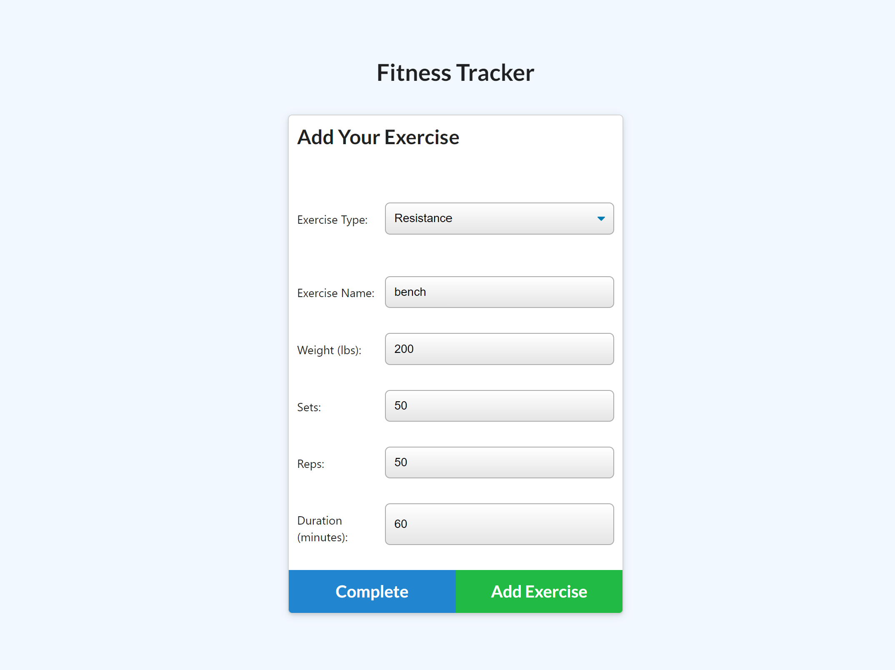
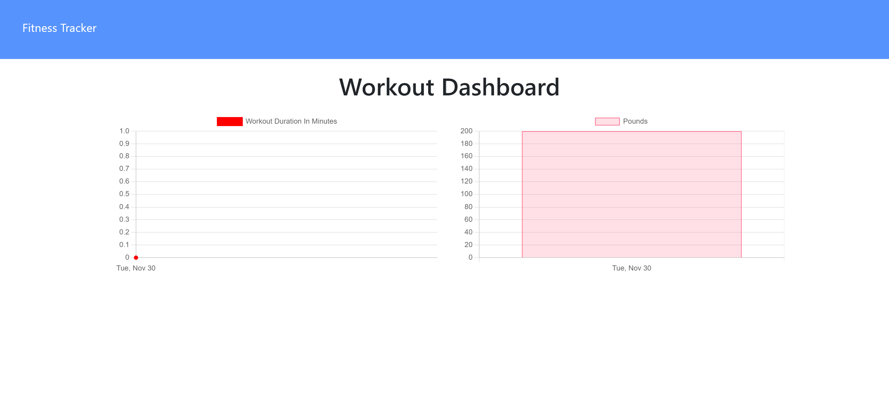

# Fitness_Tracker

## Table of Contents
 
* [Description](#Description "Goto Description")
* [Installation](#Installation "Goto Installation")
* [Usage](#Usage "Goto Usage")
* [Contributions](#Contributions "Goto Contributions")
* [Tests](#Tests "Goto Tests")
* [Questions](#Questions "Goto Questions")
- - - -

## Description

This project allows those doing workouts to keep track of their exercises!

## Installation
No installation required.

## Usage

Choose a new workout, create a new exercise and fill out the required fields in the form. Add another workout, head home, or view your workouts on the dashboard

[Deployed website](https://vast-everglades-56807.herokuapp.com/?id=61a6ead5eb8b17001691abb5)

## Contribution Guidelines

I had some help from my classmates their profiles will be linked below:

[Jessica's profile](https://github.com/jessicamcg)

[Jason's profile](https://github.com/jasonluxie)

## Tests

none

## Licence

This application uses [License: MIT](https://opensource.org/licenses/MIT)

## Questions

To see more of my projects visit my page below:
[My GitHub](https://github.com/BossyLemon0)

If you have any questions you can contact me through my email:
omardramirez2002@gmail.com

[Back to Top](#Note_Taker "Goto top")
